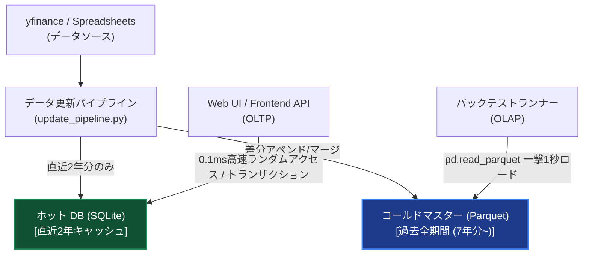

# 株式分析ツール アーキテクチャ設計仕様

当プロジェクトの目的は、個人投資家が「どの銘柄を購入すべきか」を判断するためのスクリーニング・分析機能を持つWebベースの株価分析ツールを開発することです。
本ドキュメントは、システム全体のアーキテクチャやデータの流れを定義する統合仕様書です。

## 1. 設計思想
* **バッチ処理の徹底**: GUI（フロントエンド）からリクエストが来たタイミングで数千銘柄の再計算を行うことは避けます。バックエンドのバッチ処理で計算済みの結果をDBに保存しておき、フロントエンドには「それを取得して返すだけ」という疎結合な設計を原則とします。
* **ホット/コールド・ハイブリッドデータモデル（主従逆転モデル）**: 従来の「SQLiteが真のデータマスターであり、Parquetは一時キャッシュである」という関係を完全に逆転させました。
  * **本尊（真のマスターデータソース）**: **コールド Parquetファイル (全期間歴史マスター)**
    * 圧縮・軽量化（Snappy）された単一バイナリとして永続的に保存し、バックテスト実行（OLAP）は SQLite を完全遮断して Parquet から一撃ロード（約1秒）します。
  * **仮置き場（画面・UI表示用）**: **ホット SQLiteデータベース (直近2年キャッシュ)**
    * 秒間何度も走るWeb APIからの超多頻度なランダムアクセス（OLTP）やユーザー設定の保存をミリ秒で処理するための「一時キャッシュ」に徹し、サイズを 1.7 GB 前後にスリム化・クリーン化してロック競合を永久に回避します。
* **高負荷クエリの回避 (Chunking & Projection)**: SQLite 制限（IN句の最大パラメータ上限）を回避するための 900件チャンク処理や、Parquet ロード時の PyArrow カラム射影・日付フィルタ読込を採用し、大規模データ処理における高速性と低メモリ消費を両立します。



## 2. コンポーネント構成
システムは以下の層で構成されます。

1. **フロントエンド (GUIコンポーネント)**
   * フレームワーク: Vite + React (TypeScript)
   * チャート描画: TradingView Lightweight Charts
2. **バックエンド APIサーバー**
   * フレームワーク: FastAPI (Python)
   * 役割: フロントエンドからのリクエストに応じ、DBからデータを取得・JSON整形して返す。
3. **データ収集・インジケータ計算層 (バッチ処理)**
   * 役割: スプレッドシートからの銘柄同期、yfinanceからの日次データ取得、テクニカル指標・相対評価の算出、Parquetへのアーカイブマージ、およびSQLiteへの2年分同期。
4. **バックテストエンジン (CLIバッチ)**
   * 役割: スクリーナー条件セットの有効性を過去データで検証する。SQLiteを一切掴まずに、Parquetマスターから一瞬でロードして実行する。
5. **コールドマスターデータソース (Parquet)**
   * 役割: 過去7年分〜最新すべての日足、指標、相対ランクを含む全歴史データの永続化。
6. **ホットデータベースキャッシュ (SQLite)**
   * 役割: 直近2年分のみの日足・指標・ランクの高速検索用キャッシュ (`stocktool.db`)。およびユーザー固有の永続データ管理 (`user_data.db`)。
7. **ウォッチリスト管理**
   * 役割: ユーザーが注目する銘柄を登録し、パフォーマンス（%Gain 等）を追跡する。ユーザー固有データとして `user_data.db` で管理。
8. **ポートフォリオ管理 (全体＆サブ)**
   * 役割: 総資金の管理と入出金追跡（Total Portfolio）と、サブポートフォリオにおける実際の保有銘柄・リスク管理・損益追跡。ユーザー固有データとして `user_data.db` で管理。
   * テーブル: `total_portfolios`, `transactions`, `portfolios`, `portfolio_positions`, `position_history`
   * API: `/api/portfolio/...` 配下のRESTfulエンドポイント群
   * ロジック: `backend/api/portfolio_logic.py`（純粋関数）、`backend/api/portfolio_service.py`（サービス層）

## 3. プロジェクト・ディレクトリ構成方針
全てのソースコードは役割別に `backend/` または `frontend/` 配下に集約されています。

*   **`backend/`**: Python関連の全ソースコード・パッケージを集約する親ディレクトリ。
    *   **`api/`**: バックエンドAPIサーバー（FastAPI）のロジック。責務別ルーターに分割（2026-07-04 audit D-1 対応）。
        *   `routers.py`: コア（/ping, /system/info, /symbols + 後方互換 re-export）。
        *   `screener_router.py`: スクリーナーエンジンと /screener* エンドポイント。
        *   `screener_cross_section.py`: 基準日クロスセクション構築と特殊フィルタ評価（実体は `indicators/screener_filters.py` の純関数＝バックテストと同一。audit D-2 対応）。
        *   `chart_router.py`: /chart, /earnings。
        *   `dashboard_router.py`: /dashboard, /available_dates, /theme, /group_data, /ranking。
        *   `panel_builders.py`: ダッシュボード系画面の共通アイテムビルダー。
        *   `watchlist_router.py`: /watchlist 系エンドポイント。
        *   `deps.py`: FastAPI 依存性（`get_api_db`, `get_api_user_db`）。
        *   `portfolio_router.py`: ポートフォリオ管理のAPIエンドポイント。
        *   `portfolio_service.py`: ポートフォリオのビジネスロジック（サービス層）。
        *   `portfolio_logic.py`: ポジションサイジング・損切/利確の純粋計算関数。
    *   **`data_collection/`**: データ取得、スクレイピングに関連するモジュール。
    *   **`db/`**: SQLAlchemyのモデル定義およびデータベース接続用コアロジック。
    *   **`indicators/`**: 純粋なテクニカル指標・計算アルゴリズム用モジュール群（責務別にファイルを分割管理）。
    *   **`pipeline/`**: データ取得・指標算出・DB保存などの一連の更新処理（T2〜T5フェーズ）を統括するモジュール。
    *   **`backtest/`**: バックテストエンジン（設定ファイル、シグナルスキャナー、トレードシミュレータ、レポート生成）。
    *   **`scripts/`**: バッチ処理の実行エントリポイント (`update_pipeline.py` 等)。
    *   **`tests/`**: 自動テストコード。
*   **`frontend/`**: フロントエンド（React + Vite）のソースコード全体。
    *   **`src/pages/WatchlistPage.tsx`**: ウォッチリスト専用画面（登録中・解除済みタブ）。
    *   **`src/pages/TotalPortfolioPage.tsx`**: 全体ポートフォリオダッシュボード画面（総資金、入出金、円グラフ、サブポートフォリオ一覧）。
    *   **`src/pages/PortfolioDetailPage.tsx`**: ポートフォリオ詳細画面（Positions/History/Analytics/Settings タブ）。
*   **`data/`**: 本番用データベース（`stocktool.db`, `user_data.db`）および生のデータファイル。
*   **`doc/`**: アーキテクチャ設計および各機能仕様書。
*   **`run/`**: 手動で実行する起動用バッチファイル（`.bat`）やシェルスクリプト（`.sh`）を格納。
*   **`tools/`**: DBメンテナンスや補助的なユーティリティスクリプト。
*   **`tmp/`**: 一時的なスクリプト、検証用コード、一時ログの格納先。
    *   🚨 **【重要ルール】** AIアシスタントや開発者が一時的な突合テスト・原因分析（Diag）用の使い捨てスクリプトを作成する場合は、**必ずこの `tmp/` ディレクトリ内に作成し、`backend/scripts/` などの主要ディレクトリを汚染してはならない。**用済み後は削除を推奨。

## 4. データ完全性ポリシー (Data Integrity Policy)

システムの信頼性を維持するため、以下の整合性ルールを定義し、自動検証ツール（`tools/db_health_check.py`）でチェック可能にします。

1. **ベンチマーク同期 (T2 Sync)**:
   - アクティブな全銘柄は、基準となる SPY の最新日付と同等、またはそれを超える日付の価格データ（T2）を保持していなければならない。
2. **計算網羅性 (T2 vs T3 Consistency)**:
   - 銘柄ごとの `daily_prices` (T2) の行数と `indicators` (T3) の行数は完全に一致していなければならない。
   - インジケーターの計算漏れ（T2が更新されたがT3が未計算）を許容しない。
3. **カテゴリーフィルタの例外規定**:
   - `update_pipeline.py` で `--category` 指定が行われた場合でも、RS（相対的強さ）の計算基盤となる SPY 等の基準銘柄は常に計算対象に含め、最新状態を維持しなければならない。

## 5. 各モジュールの詳細仕様
各レイヤーの詳細な設計やロジック・計算仕様については、以下のドキュメントを参照してください。

*   **[バックエンド仕様書](backend_specification.md)**
    *   データベース設計 (T1〜T6)、仮想インデックス合成ロジック、データ取得フロー、各種インジケータ算出方法、APIエンドポイントの構成、バックテストエンジンの設計。
    *   データベースのキーは仕様書に記載しフロントエンドからも参照できるようにすること。
*   **[フロントエンド仕様書](frontend_specification.md)**
    *   ダッシュボード構造、チャートペイン・比較機能、マーケットスクリーナーのカスタムフィルタ設計と実装仕様。

## 6. ポート割り当て管理 (Port Assignments)

システムを構成する各サービスのポート番号の衝突（バッティング）を避け、同時起動を可能にするため、以下の通りポート一覧を定義・管理します。

| サービス名 | ポート番号 | フレームワーク/ツール | 備考 |
| :--- | :--- | :--- | :--- |
| **Frontend (UI)** | `5173` | Vite (React) | `npm run dev` でローカル起動する際のデフォルトポート |
| **Backend API** | `8000` | FastAPI (Uvicorn) | フロントエンドと通信するAPIサーバーの標準ポート |
| **Optuna Dashboard**| `8080` | Optuna | 自動最適化（バックテスト）結果の可視化ダッシュボード |

※ デフォルトの状態で起動した場合、上記のように各サービスでポートが綺麗に分かれているため**ポート衝突は発生しません**（3つすべて同時に立ち上げておくことが可能です）。
今後、新たなツール（DB可視化ツールや、Celery等のワーカー管理画面など）を導入する場合は、上記のポート番号と競合しない値を明示的に割り当ててください。

## 7. 開発方針

### 7.1 テスト駆動開発 (TDD: Test-Driven Development)

本プロジェクトでは、**新規機能の追加・既存機能の改修**において、テスト駆動開発（TDD）を採用します。
機能を適切な粒度で関数化し、関数の単体テストを積み重ねることで、コードの品質と保守性を高めます。

#### TDDサイクル
1. **Red**: まず、実装予定の機能に対する**テストコードを先に書き**、テストが失敗する（Red）ことを確認する。
2. **Green**: テストを通すために必要な**最小限のコード**を実装する。
3. **Refactor**: テストが通った状態を維持しながら、コードの品質（可読性・保守性）を改善する。

#### 期待値の検証
1. DB に対する変更がある場合、DBに期待する値が登録されたかどうかを検証する。
2. backend にAPIエンドポイントがある場合は、DBに値が存在することを確認の上、DBの値を期待値として変更APIの期待値検証を行う。
3. frontend にUIがある場合は、APIの期待値検証の後、DBの値を期待値としてフロントエンドの画面表示の期待値検証を行う。


#### テストコードの配置規約
テストコードは **`backend/tests/`** ディレクトリ配下に、実装モジュールのディレクトリ構造と `1:1` になるようにパッケージ単位で一元集約します。テストファイル名は元のモジュール名に `test_` プレフィックスを付与した形とします。

| テスト対象モジュール | テストファイル名・配置場所 | 備考 |
| :--- | :--- | :--- |
| `backend/api/routers.py` | `backend/tests/api/test_routers.py` | API エンドポイント群の検証 |
| `backend/backtest/backtest_screener.py` | `backend/tests/backtest/test_backtest_screener.py` | エンジンの主要・独自機能 |
| `backend/pipeline/phases/t3_indicators.py` | `backend/tests/pipeline/phases/test_t3_indicators.py` | パイプライン連携部のテスト |
| `backend/indicators/moving_averages.py` | `backend/tests/indicators/test_moving_averages.py` | 各種指標計算の単体テスト |

#### テスト実行ルール
- **フレームワーク**: `pytest` を使用する。
- **実行コマンド**:
  ```powershell
  $env:PYTHONPATH="backend"; python -m pytest backend/tests/ -v
  ```
- **コミット前の義務**: コードの変更をコミットする前に、ローカルで `pytest` を実行し、**全件パス（All Green）** を確認すること。
- **適用範囲**: TDDルールは**新規機能から適用**する。既存コードに対するテスト追加は、改修のタイミングで段階的に行う。

## 8. コーディング規約・ファイルフォーマット (Coding Standards)

当プロジェクトでは、Windows環境における文字化けやGit上での改行コード混在を防ぐため、全テキストファイル（`.py`, `.md`, `.toml`, `.json`, `.tsx` 等）において以下のフォーマットを強制します。

- **文字エンコーディング**: `UTF-8 (BOMなし)`
- **改行コード**: `LF (\n)`

> [!WARNING]
> Windows標準のメモ帳や PowerShell の単純なリダイレクト（`>`）によって、意図せず `Shift-JIS (CP932)` や `UTF-8 (BOM付き)`、あるいは `CRLF (\r\n)` が混入する事故が発生しうるため注意すること。AIアシスタント等によるファイル書き込み時も、このフォーマットを厳守してください。

## 9. Python 実行環境 (Python Environment)

当プロジェクトのバックエンド処理（Pipeline, API, Backtest等）は、プロジェクトルート直下の仮想環境（`venv`）を標準の実行環境とします。

*   **環境の場所**: プロジェクトルートディレクトリにある `venv/` フォルダ。
*   **ライブラリ管理**: 追加のパッケージ（`numba` 等）をインストールする際は、必ずこの `venv` を有効化した状態で実行するか、`.\venv\Scripts\python.exe -m pip install <package>` のように仮想環境の pip を明示的に指定してインストールしてください。
*   **自動有効化**: `run/` ディレクトリ内のバッチファイル（`.bat`）は、実行時に自動的にこの `venv` をアクティベートし、適切な Python 環境を使用するように構成されています。

## 10. SQLite 並行処理と WAL モード (Concurrency & WAL Mode)

当プロジェクトでは、API サーバー（読み取り主体）とパイプライン（書き込み主体）の並行動作を安定させるため、SQLite の **WAL (Write-Ahead Logging) モード** を採用しています。

### 10.1 WAL モードの利点
*   **読取と書込 of 非ブロック**: 書き込み処理中でも API サーバーからのデータ取得を妨げず、フロントエンド of レンダリング遅延を最小限に抑えます。
*   **パフォーマンス**: 大量データの挿入（T4 相対ランク算出など）において、通常のロールバックジャーナルよりも高速に動作します。

### 10.2 読み取り/書き込みエンジンの分離 (Read/Write Engine Separation)
`database.py` では、用途別に2つの SQLAlchemy エンジンを分離しています。

| エンジン | 用途 | トランザクション | busy_timeout |
| :--- | :--- | :--- | :--- |
| `engine` / `SessionLocal` / `get_db()` | API サーバー等の読み取り | `DEFERRED`（デフォルト） | 30秒 |
| `write_engine` / `SessionLocalWrite` / `get_write_db()` | パイプライン・バッチの書き込み | `BEGIN IMMEDIATE` | 3600秒（1時間） |

*   **分離の理由**: `BEGIN IMMEDIATE` を全トランザクションに適用すると、API の SELECT までもが書き込みロックを要求し、T4 等の長時間書き込みトランザクション中に読み取りが 1 時間待機（＝ダッシュボードが無限ローディング）してしまうため。WAL の「読み取りは書き込みをブロックされない」という利点を活かすには、読み取りセッションはデフォルトの `DEFERRED` でなければなりません。
*   **使い分けルール**: `stocktool.db` へ書き込むコード（パイプライン、メンテナンススクリプト）は必ず `get_write_db()` を使用する。読み取りのみのコード（API、バックテストのキャッシュ生成）は `get_db()` を使用する。
*   **write セッション（BEGIN IMMEDIATE）の3つの制約**（2026-07-04 のパイプライン障害復旧で確立。違反すると休眠バグになる）:
    1. **`pd.read_sql` に `db.bind` を渡さない**: pandas が開く新規接続も BEGIN IMMEDIATE を発行するため、自セッションの RESERVED ロックと**自己デッドロック**する（busy_timeout の1時間ハング）。必ず `db.commit()` でロックを解放した後、`db.database.get_read_engine_for(db)` が返す読み取りエンジンで読むこと。
    2. **`PRAGMA synchronous` を実行しない**: autobegin でトランザクション内になるため "Safety level may not be changed inside a transaction" で失敗する。synchronous は接続確立時（connect イベント）でのみ設定する。
    3. **`db.execute(text("VACUUM"))` を実行しない**: 同様に "cannot VACUUM from within a transaction" で失敗する。`db.commit()` 後に素の `sqlite3.connect(db_path)` で実行する（`parquet_cache_manager.purge_sqlite_cache_older_than_2_years` 参照）。
*   **回帰テスト**: `backend/tests/db/test_database.py` が「書き込みトランザクション保持中でも読み取りがブロックされない」こと、および上記3制約の回避パターンを恒常的に検証します。

### 10.3 注意事項・トラブルシューティング
*   **Database is locked エラー**:
    - SQLite では、`PRAGMA journal_mode` などの設定変更（例: `WAL` から `MEMORY` への一時変更）を行う際、データベースへの **排他ロック (Exclusive Lock)** が必要になります。
    - API サーバーや他のコネクションが一つでも残っている状態でこれらの設定を変更しようとすると、即座に `database is locked` で失敗します。
    - **対策**: パイプライン（特に T4/T5）内での一時的な `journal_mode` 変更は避け、常に WAL モードを維持してください。

## 11. ハイブリッドデータアーキテクチャ詳細仕様

### 11.1 変数・データ構造と期間の定義
本モデルにおいて、ホット（SQLiteキャッシュ）とコールド（Parquetマスター）で管理するデータ期間および属性定義は以下の通りです。

| テーブル/データカテゴリ | コールド (Parquetマスター) | ホット (SQLiteキャッシュ) | 備考 |
| :--- | :--- | :--- | :--- |
| **symbols (T1)** | **全期間（無制限）** | **全期間（同期）** | マスタマッピングテーブル。全期間同期 |
| **theme_constituents** | **全期間（無制限）** | **全期間（同期）** | テーマの構成銘柄関係。全期間同期 |
| **daily_prices (T2)** | **全7年分〜最新日すべて** | **直近2年分のみ（730日）** | 日足。SQLite側は毎日古いデータがパージされる |
| **indicators (T3)** | **全7年分〜最新日すべて** | **直近2年分のみ（730日）** | 日足指標（48カラム）。SQLite側は2年分のみ保持 |
| **relative_ranks (T4)**| **全7年分〜最新日すべて** | **直近2年分のみ（730日）** | 相対モメンタム順位。SQLite側は2年分のみ保持 |
| **market_signals (T5)**| **対象外 (SQLiteのみ)** | **全期間（永続保存）** | 相場環境シグナル。軽量のためSQLiteに永続保持 |
| **fx_rates** | **対象外 (SQLiteのみ)** | **全期間（永続保存）** | 為替データ。軽量のためSQLiteに永続保持 |

> [!NOTE]
> スキーマ（列定義）は Parquet と SQLite で完全に同一です。Parquet は Snappy 圧縮による省スペースバイナリ、SQLite は高速ランダム検索用のインデックスインジケータ付きキャッシュテーブルとして機能します。

### 11.2 Windows同時ロック競合の完全回避（MVCC世代管理）
Windows OS環境特有の「ファイル共有ロック（PermissionError WinError 32/5）」を完全に回避するため、タイムスタンプ世代管理を導入しています。

1. **アトミック書き込み**: パイプラインは常に新しい一意のタイムスタンプ付きファイル名（例：`prices_YYYYMMDD_HHMMSS.parquet`）として書き出します。
2. **ポインタ管理**: 最新の Parquet ファイル名を指し示すメタデータポインタ（`latest_master.json`）を導入します。
3. **指数バックオフ付きリトライ**: ポインタへの一時的な同時アクセス競合を回避するため、リトライ機構（最大10回、ミリ秒単位の指数バックオフ）を実装。
4. **非同期クリーンアップ**: ポインタ更新完了後、過去の古い世代ファイルを安全に非同期的に削除します。他プロセスが掴んでいればスキップし、次回に委ねます。

### 11.3 データベースの完全再構築（Rebuild & Restore）
データベースのスキーマ変更や不整合時、いつでも以下の2ステップで本番をクリーンに完全復旧できます。
1. **SQLiteのパージ**: SQLiteのテーブルをクリア（または `stocktool.db` を削除して `create_all`）。
2. **高速バルクインサート**: Parquet から PyArrow の日付フィルターで直近2年分のみを瞬時に読み込み（1.1秒）、ネイティブな `sqlite3.executemany` と SQLite チューニング（`PRAGMA synchronous = OFF`）を組み合わせて本番DBへ高速書き込み（約3分で200万行の復旧が完了）。

---

## 12. 今後の仕様変更・検証における Sandbox 運用方針

今後、機能追加（新指標の追加やテーブル変更）やバグ修正を行う際は、**本番サービス（Uvicorn/API）を無停止かつノーリスクで維持したまま、Sandbox環境で安全にテストおよび検証**を行います。

### 12.1 Sandbox 環境のディレクトリ構成
*   **システムDB (SQLite Sandbox)**: `data/sandbox/stocktool.db`
*   **ユーザーDB (SQLite Sandbox)**: `data/sandbox/user_data.db`
*   **コールドマスター (Parquet Sandbox)**: `data/sandbox/parquet/` (※システムDBパスと同じディレクトリ階層から自動解決)

### 12.2 Sandbox への切り替えと設定方法
テストや開発のスクリプト実行時、環境変数 `STOCKTOOL_ENV` を `sandbox` に設定するだけで、ウォッチリスト等のユーザーデータも含めて安全にサンドボックス環境へ切り替わります。

*   **PowerShell の場合**:
    ```powershell
    $env:STOCKTOOL_ENV="sandbox"
    # この状態でスクリプトを実行
    python backend/scripts/update_pipeline.py
    ```
*   **CMD / Batch の場合**:
    ```cmd
    set STOCKTOOL_ENV=sandbox
    python backend/scripts/update_pipeline.py
    ```

> [!TIP]
> 個別にカスタムパスを指定してオーバーライドしたい場合のみ、レガシー環境変数 `STOCKTOOL_DB_PATH` / `STOCKTOOL_USER_DB_PATH` を個別に指定します（※設定漏れに十分注意すること）。

### 12.3 変更適用の安全な移行ワークフロー（プロモーション手順）
1.  **データのコピー**: 本番の最新 Parquet データを `data/parquet_master_sandbox/` にコピーして Sandbox 用の初期データを用意。
2.  **検証の実施**: Sandbox 環境へ切り替えて、新規の計算処理や指標ロジックを回し、`parquet_master_sandbox/` および `stocktool_sandbox.db` が正常かつ正確に更新されるかをテスト。
3.  **本番コールドの更新**: テスト成功後、`parquet_master_sandbox/` の検証済み Parquet ファイルを本番の `data/parquet_master/` へアトミックに差し替え（ポインタ更新）。
4.  **本番ホットの同期**: 本番 SQLite DB の該当テーブルキャッシュをクリアし、復旧スクリプト（`restore_sqlite_cache_from_parquet`）を走らせて直近2年分を本番 SQLite DB へ爆速バルク同期。
