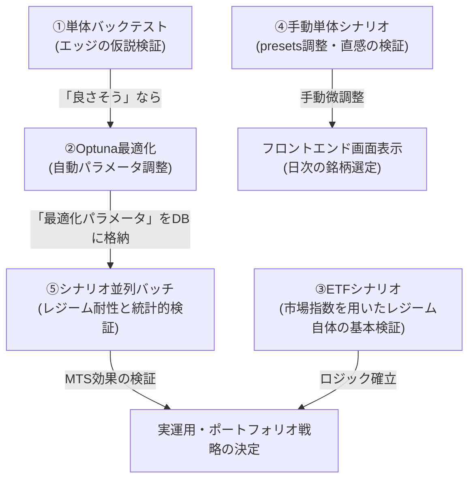

# バックテスト仕様書 (Backtest Specification)

本ドキュメントは、`stocktool` におけるシステムトレードバックテストエンジン（`backend/backtest/`）の基本仕様、およびレポートで出力される各評価指標（変数値）の数学的な定義をまとめたものです。

各戦略の設定（`backtest_config.toml`）で利用可能な変数の詳細については、[バックテスト設定変数仕様書](backtest_config_spec.md) を参照してください。

## 0. バックテスト・シミュレーションの種類と役割

ご認識の通り、本システムには目的、データソース、およびシミュレーションモデルに応じて以下の5種類のテスト（検証）方法が実装されており、それぞれ使い分けられています。

| テストの分類 | 実行コマンド / スクリプト | 主要なインプット | 主な評価アプローチと目的 |
| :--- | :--- | :--- | :--- |
| **① バックテスト (スクリーンパラメータ単体実行)** | `backtest_runner.py` / `run_backtest.bat` | `backtest_config.toml` | 単一の戦略・固定パラメータに対して、**単利・加算ベース（Additive PnL）**でアラート（シグナル）そのものの純粋なエッジ（優位性）を検証する。 |
| **② バックテスト (スクリーンパラメータ最適化)** | `optimization_runner.py` / `run_optimization.bat` | `backtest_config.toml` | **Optuna（ベイズ最適化）**を用いて、ブル・ベアの複数期間において総合的にパフォーマンスが高くなるパラメータの組み合わせを自動探索する。 |
| **③ ETFシナリオテスト** | `etf_scenario_runner.py` | `etf_scenario_config.toml` | VXV/VIX EMA や SPY SMA200 などの市場レジームシグナルに基づき、指数ETF（SPY, QQQ, TQQQ 等）を切り替えるポートフォリオ運用の長期複利シミュレーション。 |
| **④ 個別銘柄シナリオテスト (単体実行)** | `scenario_runner.py` / `run_scenario_test.bat` | `screener_presets.toml` `scenario_config.toml` | 手動調整用プリセットから Voting（合算スコア）で銘柄を動的選別し、最大ポジション数等の制約下で**複利（Portfolio compounding）運用**の推移をマニュアル検証する。 |
| **⑤ 個別銘柄シナリオテスト (並列バッチ実行)** | `run_scenario_batch.py` / `run_scenario_batch.bat` | `optimization_trials.db` | 最適化された各戦略に対し、5つのレジームモデルとモンテカルロ試行（各10回）を並列実行して、ロジック自体の優位性やドローダウンの分布を**統計的・客観的に一括評価**する。 |

### 各テストの使い分けと開発サイクル

---

## 1. バックテストエンジンの基本仕様

バックテストエンジンは、指定された期間（`start_date` 〜 `end_date`）の日足データとテクニカル指標のキャッシュをメモリ上に展開し、日次のシミュレーションを行います。

*   **SQLite DB の完全遮断 ➔ Parquet 一撃ロード**:
    - 本エンジンは、稼働中の API サーバーや定期バッチ（SQLite）と競合を起こさないよう、**SQLite へのアクセスを「完全遮断（DB接続すら行わない）」** します。
    - データは、本尊である過去全期間の歴史マスター Parquet（[data/parquet_master/](file:///d:/My%20Documents/Programing/stocktool/data/parquet_master/)）から直接 `pd.read_parquet()` で一撃ロード（約1秒）されます。これにより、Windows 環境下でバックテストを同時に何個並列で走らせても、`database is locked` や `PermissionError` のロック競合は 100% 発生しません。
*   **PyArrow フィルターによるメモリ安全設計 (OOM回避)**:
    - 5年以上の全歴史データをロードする際も、探索期間の `start_date` と `end_date` に基づき、PyArrow レベルで自動的に日付フィルター（`filters`）を適用してディスク段階で読み込みサイズを最適化。メモリ不足によるハングアップ（OOM）を物理的に完全回避します。
*   **単利・固定資金アプローチ（Additive PnL）**:
    - 本エンジンは「初期資金◯◯万円から複利で運用する」というポートフォリオレベルのシミュレーション**ではなく**、個別のアラート（シグナル）そのものの**エッジ（優位性）を純粋に評価する**ためのエンジンです。
    - そのため、すべてのトレード結果（損益パーセンテージ）は**単利・加算ベース（Additive）**で集計されます。
    - *例: +10% の利益と -5% の損失が連続した場合、合計リターンは `10 + (-5) = +5 ポイント（加算）` となります。*
*   **多彩な手仕舞い戦略 (Exit Strategy Type)**:
    - 従来通りの固定損切り・利確ルールを適用する `fixed` のほか、強制決済期間(`failsafe_max_days`)まで単純に保有し続ける `hold` (バイ・アンド・ホールド)、および市場の恐怖指数指標である VXV/VIX 比率（^VIX3M / ^VIX）が設定値を割り込んだ時点で手仕舞いを行う `vxv_vix_ratio` の各戦略タイプが組み込まれています。これにより、システムおよび外部市場環境に連動した高度な出口戦略の検証が可能です。

---

## 2. バックテスト結果の変数定義一覧

最適化時や最終レポート出力時に `calculate_metrics()`（`backtest_report.py`）から生成される各変数の定義は以下の通りです。

### 2.1 基礎指標 (Basic Metrics)
| 変数名 | 日本語名 | 計算定義・意味 |
| :--- | :--- | :--- |
| `total_trades` / `trades` | 総トレード数 | 該当期間中にエントリーからエグジット（または期間終了による強制決済）まで完了した総取引回数。 |
| `wins` / `win_trades` | 勝ちトレード数 | `pnl_pct`（純利益率）が > 0 となった取引の回数。 |
| `win_rate` | 勝率 | `wins / total_trades`。勝ちトレードの割合。 |
| `avg_holding_days` | 平均保有日数 | エントリー日からエグジット日までの営業日数の平均。 |

### 2.2 リターン・リスク指標 (Return & Risk Metrics)
| 変数名 | 日本語名 | 計算定義・意味 |
| :--- | :--- | :--- |
| `avg_win` | 平均利益率 | 勝ちトレードにおける `pnl_pct` の平均値。 |
| `avg_loss` | 平均損失率 | 負けトレードにおける `pnl_pct` の平均値。（※マイナスの数値として表現されます） |
| `profit_factor` | プロフィットファクター (PF) | `総利益の合計 ÷ 総損失の合計(絶対値)`。1.0 を超えていれば総合的に利益が損失を上回っていることを示します。 |
| `expectancy` | 期待値 (Expectancy) | `(勝率 × avg_win) + ((1 - 勝率) × avg_loss)`。 1トランザクションを行うごとに平均して何%の利益（または損失）が期待できるかを表す**最も重要な評価指標**です。 |
| `avg_gain` | 平均ゲイン | 全トレードの `pnl_pct` を取引回数で単純に割ったもの。数学的には `expectancy` に限りなく等しい指標です。 |

### 2.3 ベンチマーク比較指標 (Benchmark Metrics)
市場平均（インデックス）に対して、その戦略が優位性を持っていたかを評価するための指標です。

| 変数名 | 日本語名 | 計算定義・意味 |
| :--- | :--- | :--- |
| `avg_spy_gain` | SPY平均リターン | 全く同じ日時にエントリーし、全く同じ日時にエグジットした場合の **S&P 500 (SPY)** の平均リターン（%）。 |
| `alpha` | アルファ値 | `avg_gain - avg_spy_gain`。 地合いの良さ（SPYの上昇）による単純な恩恵ではなく、**その戦略（フィルタリング条件）自体がSPYのパフォーマンスをどれだけ上回ったか（超過リターン）**を示します。 |

### 2.4 累積指標 (Cumulative Output)
| 変数名 | 日本語名 | 計算定義・意味 |
| :--- | :--- | :--- |
| `total_return_pct` | 累積リターン | 全トレードの損益% (`pnl_pct`) を単純加算した合計値。 *※前述の通り加算ベースであるため、数千件の取引が発生する戦略では +数百% などの非現実的な数値にスケールすることがあります。あくまで戦略間の相対比較用です。* |
| `max_drawdown_pct` | 最大ドローダウン (加算ベース) | トレード履歴を時系列に並べ、加算ベースの `累積リターン` が過去の最高到達点（ピーク）から**最大で何ポイント下落したか**を示す絶対値。 *※ Optunaではこの数値が巨大になりすぎないよう、1日平均の取引件数で正規化(Normalize)してからスコアの割引係数として使用します。* |
| `exit_reasons` | エグジット理由内訳 | なぜ手仕舞いされたか（例: `STOP_LOSS`, `TRAILING_STOP`, `RRG_MOMENTUM_LOSS`, `END_OF_PERIOD`など）の集計辞書データ。 |
