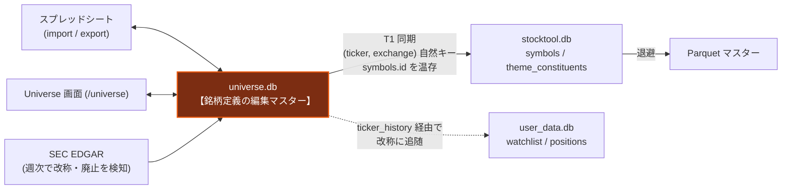

# `universe.db` 仕様（銘柄定義の編集マスター）

`data/universe.db` は **銘柄の定義を人間が編集する唯一の場所**です。
株価や指標を持たず、「どの銘柄を・どう分類して・どのテーマに属させるか」だけを保持します。

ホット/コールドの二層（`stocktool.db` / Parquet）とは**別系統**で、
データの3分類（`agent_execution_rules.md` §10.1）では **ユーザー資産**に相当します。

> [!CAUTION]
> **swap・クリア・再構築は禁止。バックアップ取得 → in-place マイグレーションのみ。**
> 手動編集の結果と `ticker_history` は**再生成できません**。
> 全期間再構築（`refresh_All.bat`）の対象外であり、あれは `stocktool.db` と Parquet だけを作り直します。

---

## 1. 位置づけとデータフロー



| 観点 | 内容 |
| :--- | :--- |
| **役割** | 銘柄の定義（分類・名称・テーマ構成・改称履歴）の正 |
| **下流** | T1 同期 → `stocktool.db` → Parquet |
| **編集手段** | Universe 画面 / スプレッドシート import / `backend/scripts/` の各スクリプト / SEC 週次同期 |
| **バックアップ** | 書き込みスクリプトが `universe.db.bak_YYYYMMDD_HHMMSS` を自動取得 |

---

## 2. テーブル定義

### 2.1 `symbols_master`（3,255行 / うち active 3,220）

| カラム | 型 | 説明 |
| :--- | :--- | :--- |
| `id` | INTEGER PK | universe.db 内部の id。**`stocktool.db` へは持ち込まない**（§3.1） |
| `ticker` | VARCHAR NOT NULL | ティッカー。仮想テーマは `_XXX_` 形式 |
| `exchange` | VARCHAR | 取引所。仮想テーマは `VIRTUAL` |
| `name` | VARCHAR | 銘柄名 |
| `category` | VARCHAR NOT NULL | 個別 2,881 / テーマ 273 / 市場 24 / セクタ 16 / レバレッジ 16 / 指標 10 |
| `industry` | VARCHAR | 業種 |
| `theme_type` | VARCHAR | `virtual` / `sector` / `theme` / `etf` / NULL。**導出は `data_collection/symbol_classify.derive_theme_type()` に一元化** |
| `sector_etf` | VARCHAR | 親セクタ ETF |
| `active` | SMALLINT | ソフトデリート（1: 有効 / 0: 退役） |
| `source` | VARCHAR | 由来。`spreadsheet_url` / `pipeline` / `manual` / NULL |
| `cik` | INTEGER | SEC 登録主体 ID。**個別銘柄の突合キー**（§4） |
| `sec_class_id` | VARCHAR | SEC のファンドクラス ID。**ETF はこちらを優先** |
| `sec_checked_at` | DATETIME | 最後に SEC と突合した日時 |
| `created_at` / `updated_at` | DATETIME | — |

**一意制約**: `(ticker, exchange)` ← T1 同期の自然キー
**索引**: `ticker` / `(active, category)` / `cik` / `sec_class_id`

### 2.2 `theme_members`（4,710行）

テーマと構成銘柄の関係。`(theme_ticker, member_ticker)` が一意。

| カラム | 型 | 説明 |
| :--- | :--- | :--- |
| `theme_ticker` | VARCHAR NOT NULL | 親テーマのティッカー |
| `member_ticker` | VARCHAR NOT NULL | 構成銘柄のティッカー |
| `weight` | FLOAT | 重み（現状すべて 1.0） |
| `source` | VARCHAR | 由来。replace インポートの保護判定に使う |

**ティッカー文字列で結合している**点に注意。改称時は `rename_symbol.py` が
`theme_ticker` / `member_ticker` の両方を連動更新します。

### 2.3 `ticker_history`（16行）

改称の記録。**`user_data.db` の自動追随がこれを引きます**（§5）。

| カラム | 型 | 説明 |
| :--- | :--- | :--- |
| `current_ticker` | VARCHAR NOT NULL | 改称後 |
| `old_ticker` | VARCHAR NOT NULL | 改称前 |
| `old_exchange` | VARCHAR | 改称前の取引所 |
| `changed_at` | VARCHAR NOT NULL | 記録日（ISO 文字列） |
| `reason` | VARCHAR | 根拠。SEC 由来なら CIK 等を含む |

**一意制約**: `(old_ticker, old_exchange)` — 同じ旧ティッカーを二重記録しない

> [!IMPORTANT]
> **改称を適用するすべての経路がここに書きます**（`rename_symbol.py` と Universe 画面の両方）。
> この網羅性が `user_data.db` の追随（§5）とウォッチリストの耐久性を支えているため、
> 履歴を書かずにティッカーを直接 UPDATE してはいけません。

---

### 2.4 `ipo_candidates`（レビュー待ちの新規上場銘柄）

週次スキャンが検知した IPO 候補を、人間が採用/却下するまで保持する。
検知ロジックは `data_collection/ipo_discovery.py`、実行は `scripts/scan_ipo_candidates.py`。

| カラム | 型 | 説明 |
| :--- | :--- | :--- |
| `ticker` / `exchange` | VARCHAR | Yahoo の `fullExchangeName` を取引所として持つ |
| `name` / `cik` | — | SEC マスタ由来 |
| `first_trade_date` | VARCHAR | **上場日。Yahoo `firstTradeDate`**（SEC は上場日を持たない） |
| `market_cap` / `avg_volume` / `last_price` | — | 検知時点のスナップショット。追い続けない |
| `sector` / `industry` / `summary` / `website` | — | `.info` 由来。テーマのタグ付け判断用。取得失敗を許容（NULL 可） |
| `flags` | VARCHAR | `spac` / `fund` / `adr` のカンマ区切り。**除外理由の記録であって削除ではない** |
| `status` | VARCHAR | `pending` / `accepted` / `rejected` / `auto_excluded` |
| `status_note` / `reviewed_at` / `detected_at` | — | — |

**一意制約**: `(ticker, exchange)` / **索引**: `ticker` / `cik` / `status`

> [!IMPORTANT]
> **却下しても行は消しません。** `status='rejected'` で残すことで画面のトグルから
> 復活でき、かつ再スキャンで同じ銘柄が `pending` に戻ってきません。
> **`status` が `pending` 以外の行は再スキャンが上書きしません**（人間の判断だから）。

---

## 2.5 IPO 候補の検知（SEC → universe.db）

既存の SEC 同期（§4）は universe.db → SEC の方向にしか走査しないため、
**「新規上場」は構造的に検知できません**。本機能は逆方向に走査します。

| SEC マスタの (cik, ticker) | 意味 | 担当 |
| :--- | :--- | :--- |
| cik 既知 / ticker 既知 | 既存銘柄 | — |
| cik 既知 / ticker 未知 | 改称・新クラス上場 | **§4 の SEC 同期** |
| **cik 未知** | 新規発行体 | **本機能** |

この切り分けにより二重検知が起きません。

### 判定パイプライン

```
[1] SEC company_tickers.json（週次同期が取得済み。追加リクエスト 0）
[2] 除外: symbols_master 全件（active 問わず）/ ipo_candidates 全件
         / ticker_history.old_ticker / company_tickers_mf.json
[3] cik 未知の CIK だけ残す                    → 実測 5,117 CIK
[4] CIK 内で普通株を1本選抜                    → 実測 4,011
      ADR(`[A-Z]{4,5}[YF]`)・ダッシュ優先株(`-P*`)を落とす
      → 残りが空なら CIK ごと除外（ADR のみ 873 CIK / 優先株のみ）
      → 最短をベースとし、他が全てユニット・ワラント・ライツなら採用
      → それ以外で2本以上残れば複数クラス別上場として CIK ごと除外（231 CIK）
[5] フラグ付け: 社名 `acquisition|merger` → spac / `ETF|funds?` → fund
              / `american depositary` → adr、**ユニット兄弟があれば** spac
[6] Yahoo chart API（4 req/s）で確定
      取引所 完全一致 {NasdaqGS, NasdaqGM, NasdaqCM, NYSE, NYSE American}
      instrumentType == 'EQUITY' / firstTradeDate >= config の ipo_scan.since
[7] 通過分に `.info` で企業概要を付与 → upsert
```

### 実測で確定した4つの落とし穴

> [!CAUTION]
> **① `instrumentType` / `longName` で株式種別は判定できない。**
> `SCAG`(普通株) も `SCAGW`(ワラント) も `EQUITY` / "Scage Future" を返す。
> `EURKU`(ユニット) も "Eureka Acquisition Corp"。**ティッカー構造で見るしかない。**
>
> **② 取引所は完全一致。** `'NYSEArca'.startswith('NYSE')` は True になり、
> ETF・信託の取引所が混入する（`MSBT` Morgan Stanley Bitcoin Trust が実際に通過した）。
>
> **③ SPAC の兄弟ティッカーは語幹が伸びる。** `JAB` の兄弟は `JABRR`/`JABRU`/`JABRW`。
> 「ベース＋サフィックス」の完全一致では**262 件を取りこぼす**。末尾1文字で見る。
>
> **④ ユニットとワラントを区別する。** ユニットは合併成立時に消滅するため、
> **ユニットがある＝現役 SPAC / ワラントだけ残る＝de-SPAC 済みの実業会社**。
> 区別しないと `SCAG`(Scage Future) `INV`(Innventure) `HPAI` `FOXX` を捨ててしまう。

`Trust` は社名フィルタに**入れません**。実測で該当した4件はいずれも REIT
（`OPI` Office Properties / `TPTS` Terra Property）で、除外すると正当な銘柄を落とします。
暗号資産信託は NYSEArca なので取引所判定で落ちます。

### 採用した銘柄が退役候補に落ちない仕組み

上場直後の銘柄は行数が少ないため `classify_symbol_freshness()` は `no_history`
（退役候補）と分類します。**これは仕様どおりで、変更してはいけません** —
上場2週間の IPO と供給側にデータが無い銘柄（`LC`: 7行・最新）は
`(row_count, last_date, spy_latest)` だけでは原理的に区別できないからです。

実際に退役されないことは **`split_by_sec_verdict()` の SEC 突合**が担保します。
採用した IPO 銘柄は必ず SEC マスタに載っている（そこから検知したため）ので、
「SEC 上は健在」として自動退役 CSV から外れます。

---

## 3. T1 同期（universe.db → stocktool.db）

実装: `backend/data_collection/universe_sync.py::sync_symbols_from_universe()`

### 3.1 `symbols.id` の温存は絶対制約

> [!CAUTION]
> **同期は `(ticker, exchange)` を自然キーとした upsert で行い、既存の `symbols.id` を必ず温存します。**
> `daily_prices` / `indicators` / `relative_ranks`（各約157万行）と Parquet マスター全期間が
> `symbols.id` の整数 FK で紐付いているため、id が振り直されると価格履歴が孤児化します。
> **`universe.db` の `id` は一切持ち込みません。**

`exchange` が変わると自然キーが外れて新 id が採番されるため、同一 ticker の既存行が
一意に定まる場合は**新規採番せず `exchange` を更新して id を温存**します（警告ログ）。
2026-07-28 に `GBTC` が `(GBTC,'US')` → `(GBTC,'NASDAQ')` となり、この救済が無かったため
id=3256 と id=3258 の重複行が実際に発生しました。

### 3.2 全期間再構築では id が再採番される

再構築（`refresh_All.bat`）は**サンドボックスの空 DB** から始まるため、温存する相手が居ません。
退役済み銘柄は新 DB に作られないので、その分だけ後続の id が前へ詰まります。

```
2026-08-06 の再構築: 共通3,220ティッカーのうち 2,378件で id が変化
  CAT 845→844 / CATY 846→845 / CAVA 847→846 ...
```

再構築後は **`backend/scripts/remap_user_data_symbol_ids.py --apply`** が必須です。
手順の全体は `.claude/skills/parquet-data-quality/SKILL.md` §9。

---

## 4. SEC EDGAR 連携

**ティッカーは変わるが CIK と classId は変わらない。** これを軸に週次で改称・上場廃止を検知します。
判定ロジックと自動適用のガードは `backend_specification.md` §8.4 を参照。

### キーの選び方

```
個別銘柄        … cik           （company_tickers.json）
ETF・ファンド   … sec_class_id  （company_tickers_mf.json）
                  CIK はトラスト単位で粗すぎる。RSHO の CIK 1944285 は
                  Tema ETF Trust の13ファンドを含むため、ファンド単位で追えない
指数・仮想テーマ … 両方 NULL    （SEC に登録主体が無い。追跡対象外）
```

### 解決状況（2026-08-06 実測）

| カテゴリ | cik | classId | 未解決 | 解決率 |
| :--- | ---: | ---: | ---: | ---: |
| 個別 | 2,911 | 1 | 4 | 99.9% |
| 市場 / セクタ / レバレッジ | 8 | 48 | 0 | 100% |
| テーマ | 6 | 95 | 172 | 37.0%（残りは仮想テーマ＝対象外） |
| 指標 | 5 | 3 | 2 | 80.0%（残りは指数＝対象外） |

未解決6件（`AWAY` `DOGEF` `GIGGU` `IPAY` `TBRG` `XWIN`）は廃止 ETF・OTC 外国株で、
SEC に実体がないため**永久に NULL** です。改称・廃止は手動で気づく必要があります。

新規追加銘柄のキーは、週次同期の冒頭 `resolve_missing_keys()` が毎回拾い直します。

---

## 5. 改称の下流への伝播

改称を適用すると `rename_symbol.py::rename_one()` が次を一括で行います。

| 対象 | 処理 |
| :--- | :--- |
| `symbols_master` | `ticker`（必要なら `exchange` / `theme_type`）を更新。**`id` は不変** |
| `theme_members` | `theme_ticker` / `member_ticker` を連動更新 |
| `ticker_history` | 旧ティッカーを記録 |
| `user_data.db` | `watchlist` / `portfolio_positions` の `ticker` を更新（push） |
| `stocktool.db` | **触らない。** 翌日の T1 同期で新ティッカーの行が作られ、旧行は `active=0` に落ちる |

`position_history` の `ticker` は**書き換えません**（取引記録としての正確さを優先）。
push を通さずに入り込んだ行は、API 起動時の heal が `ticker_history` を辿って自動修復します
（pull。`backend_specification.md` §5.1.1）。

---

## 6. 触れるスクリプト一覧

| スクリプト | 用途 |
| :--- | :--- |
| `scripts/rename_symbol.py` | 改称（§5） |
| `scripts/retire_stale_symbols.py` | 退役（`active=0`）。テーマの親は保護 |
| `scripts/sync_sec_corporate_actions.py` | SEC 週次突合（§4）。週次メンテから自動実行 |
| `scripts/migrate_universe_sec_keys.py` | SEC キーの初回付与（冪等） |
| `scripts/remap_user_data_symbol_ids.py` | 再構築後の `user_data.db` 再マップ（§3.2） |
| `data_collection/sheet_importer.py` | スプレッドシート import（§7） |
| `data_collection/universe_sync.py` | T1 同期（§3） |
| `scripts/scan_ipo_candidates.py` | IPO 候補の検知（§2.5）。週次メンテから自動実行 |
| `scripts/migrate_universe_ipo_candidates.py` | `ipo_candidates` テーブルの追加（冪等） |
| `data_collection/ipo_discovery.py` | IPO 候補の判定ロジック（純粋関数） |
| `api/universe_router.py` | Universe 画面のバックエンド（候補レビュー API を含む） |

---

## 7. スプレッドシート import の replace モード

`replace` は**「全削除 → 挿入」ではなく「upsert ＋ シートから消えた行の削除」**です。

- **シート由来でない行（`source != 'spreadsheet_url'`）は保護**します。
  `source` が NULL の行も出所不明として保護側に倒します。
- **掲載中の行は更新にとどめます。** 全 DELETE → INSERT だと importer が知らない列
  （`cik` / `sec_class_id` / `sec_checked_at`）が毎回 NULL に戻り、`id` も振り直されるためです。
  SEC キーが消えるとその銘柄は**改称・上場廃止の追跡対象外**に静かに落ちます。
- 取得件数が10件未満なら**誤消去防止のため処理ごとキャンセル**します（権限エラー対策）。

`theme_members` は id を外部参照されない関連表なので、シート由来分は全消し→再構築です。

---

## 8. 関連ドキュメント

| 文書 | 内容 |
| :--- | :--- |
| `backend_specification.md` §3.1 | `stocktool.db` 側 `symbols` のカラム仕様・`theme_type` 導出・`tags` の意味論 |
| `backend_specification.md` §5.1.1 | heal（`symbol_id` 自己修復）と改称追随の push/pull |
| `backend_specification.md` §8.4 | SEC コーポレートアクション同期の判定ロジック |
| `architecture.md` §11.1 | ホット/コールドの二層と本 DB の位置づけ |
| `agent_execution_rules.md` §10.1 | データ3分類とユーザー資産の扱い |
| `.claude/skills/parquet-data-quality/SKILL.md` §9 | 全期間再構築の手順書 |
| `.claude/skills/upstream-data-diagnosis/SKILL.md` §5.1 | SEC EDGAR での事実確定 |
| `doc/completed/universe_db_migration_plan.md` | スプレッドシートからの移行経緯 |
